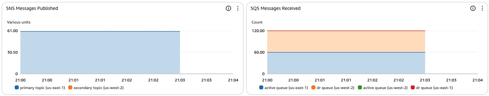
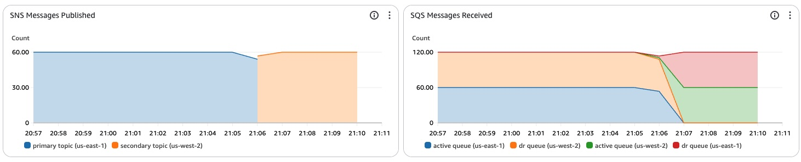

# SQS Multi-Region: SNS Fan-Out Pattern

Amazon Simple Queue Service (SQS) is widely adopted by organizations for its ability to reliably decouple microservices, process event-driven applications, and handle high-volume message delivery without infrastructure management overhead. As businesses face increasing demands for 24/7 availability and regulatory requirements for geographic redundancy, many are exploring multi-Region architectures to enhance their messaging systems' resilience against Regional service disruptions. To address this need, Amazon's Simple Notificiation Service's (SNS) cross-Region delivery capabilities allow messages to be sent to SQS queues in different Regions, enabling customers to implement robust, fault-tolerant messaging architectures that span multiple AWS Regions, thus ensuring business continuity and maintaining message integrity even during localized disruptions.


## How it works

This demo deploys a multi-Region message processing architecture with the following components:
- SNS topics in both primary and secondary Regions
- an active and a Disaster Recovery (DR) SQS queues in both Regions, including their respective SNS subscriptions
- Four AWS Lambda functions (one per queue) to process messages
- A CloudWatch dashboard for monitoring message flow
- Rquired IAM permissions and policies


Message flow in normal operation:
1. The producer publishes messages to the SNS topic in the primary Region
2. The primary SNS topic fans out messages to:
    - The active SQS queue in the primary Region
    - The DR SQS queue in the primary Region
3. AWS Lambda functions process messages from both queues

During failover:
1. The producer switches to publishing messages to the SNS topic in the secondary Region
2. The secondary SNS topic fans out messages to:
    - The active SQS queue in the secondary Region
    - The DR SQS queue in the secondary Region
3. AWS Lambda functions in the secondary Region take over message processing

## Prerequisites
- AWS SAM CLI configured with appropriate permissios
- Ruby 2.7 or later(for running the producer script)
- Git

## Deployment Instructions
1. Create a new directory, navigate to that directory in a terminal and clone the GitHub repository:
    ```
    git clone https://github.com/aws-samples/sample-sns-sqs-multi-region.git
    ```
1. Change directory to:
    ```
    cd sample-sns-sqs-multi-region
    ```
1. [Optional] Configure deployment Regions. The default configuration deploys to us-east-1 (primary) and us-west-2 (secondary). If you want to change it, edit ./bin/config.sh, on lines 5 and 6:
    ```bash
    #!/bin/bash
    export STACK_NAME=sns-sqs-multi-region
    export PRIMARY_ENV=primary
    export SECONDARY_ENV=secondary
    export PRIMARY_REGION=us-east-1
    export SECONDARY_REGION=us-west-2
    ```

1. From the command line, use shell script to deploy the AWS resources to the primary and secondaty Regions:
    ```
    ./bin/deploy-stacks.sh 
    ```

## Testing
The testing procedure demonstraces message publishing to the primary Region, cross-Region message delivery and Regional failover.

1. Install the required dependencies:
    ```
    bundle install
    ```
1. Set execution permissions for the shell scripts:
    ```
    chmod +x ./bin/*
    ```
1. run the message producer, publishing messages to the primary SNS topic on us-east-1:
    ```
    ./bin/run-producer.sh primary
    [15:10:12.000] Publishing to us-east-1 ...
    [15:10:13.000] Sending message {"recorded_at":1743433813000} ...
    [15:10:14.000] Sending message {"recorded_at":1743433814000} ...
    [15:10:15.000] Sending message {"recorded_at":1743433815000} ...
    [15:10:16.000] Sending message {"recorded_at":1743433816000} ...
    [15:10:17.000] Sending message {"recorded_at":1743433817000} ...
    [15:10:18.000] Sending message {"recorded_at":1743433818000} ...
    [15:10:19.000] Sending message {"recorded_at":1743433819000} ...
    [15:10:20.000] Sending message {"recorded_at":1743433820000} ...
    ```

    The producer sends one message per second to the SNS topic with a timestamp payload.

1. Monitor message traffic in CloudWatch:
   - Open the CloudWatch dashboard named "SnsSqsMultiRegion-*" in your primary Region
   - Verify messages are flowing through both primary and secondary Region queues
   
   

1. Tail the AWS Lambda function that consumes data from the active queue on us-east-1:
    ```
    ./bin/tail-AWS Lambda-consumer.sh primary active
    Tailing SqsConsumer in us-east-1...
    2025/04/26/[$LATEST]8e2905acb4eb441f80066ec163908fae 2025-04-26T19:14:01.235000 {"recorded_at"=>1745694841003}
    2025/04/26/[$LATEST]8e2905acb4eb441f80066ec163908fae 2025-04-26T19:14:02.247000 {"recorded_at"=>1745694842005}
    2025/04/26/[$LATEST]8e2905acb4eb441f80066ec163908fae 2025-04-26T19:14:03.231000 {"recorded_at"=>1745694843002}
    2025/04/26/[$LATEST]8e2905acb4eb441f80066ec163908fae 2025-04-26T19:14:04.238000 {"recorded_at"=>1745694844002}
    2025/04/26/[$LATEST]8e2905acb4eb441f80066ec163908fae 2025-04-26T19:14:05.230000 {"recorded_at"=>1745694845001}
    ```

    You can see that the AWS Lambda function is actively consuming the data being pushed into that queue. You can now stop the tail command (Ctrl+C).

1. Tail the AWS Lambda function that consumes data from the DR queue on us-west-2:
    ```
    ./bin/tail-AWS Lambda-consumer.sh secondary DR
    Tailing DrSqsConsumer in us-west-2...
    2025/04/26/[$LATEST]068ce66f644740a583b9b33a7b08711e 2025-04-26T19:16:07.402000 {"recorded_at"=>1745694967005}
    2025/04/26/[$LATEST]068ce66f644740a583b9b33a7b08711e 2025-04-26T19:16:08.268000 {"recorded_at"=>1745694968004}
    2025/04/26/[$LATEST]068ce66f644740a583b9b33a7b08711e 2025-04-26T19:16:09.309000 {"recorded_at"=>1745694969005}
    2025/04/26/[$LATEST]068ce66f644740a583b9b33a7b08711e 2025-04-26T19:16:10.255000 {"recorded_at"=>1745694970000}
    2025/04/26/[$LATEST]068ce66f644740a583b9b33a7b08711e 2025-04-26T19:16:11.265000 {"recorded_at"=>1745694971005}
    ```

    You can see that the AWS Lambda function is actively consuming the data being pushed into that queue. You can now stop the tail command (Ctrl+C).

1. Test a message producer Regional failover:
   - Stop the message producer (Ctrl+C)
   - Start the message producer, now publishing messages to the SNS topic in the secondary Region:
    ```
    ./bin/run-producer.sh secondary
    [15:44:25.876] Publishing to us-west-2 ...
    [15:44:26.005] Sending message {"recorded_at":1745613866005} ...
    [15:44:27.000] Sending message {"recorded_at":1745613867000} ...
    [15:44:28.001] Sending message {"recorded_at":1745613868001} ...
    [15:44:29.003] Sending message {"recorded_at":1745613869003} ...
    [15:44:30.005] Sending message {"recorded_at":1745613870005} ...
    [15:44:31.005] Sending message {"recorded_at":1745613871005} ...
    [15:44:32.001] Sending message {"recorded_at":1745613872001} ...
    [15:44:33.005] Sending message {"recorded_at":1745613873005} ...
    ```

    The producer now sends the messages to the SNS topic on us-west-2. After a few minutes, the dashboard will now show traffic going to the secondary SNS topic on us-west-2 and to the SQS queues subscribed to that topic.

    

1. Tail the AWS Lambda function that consumes data from the active queue on us-west-2:
    ```
    ./bin/tail-AWS Lambda-consumer.sh secondary active
    Tailing SqsConsumer in us-west-2...
    2025/04/26/[$LATEST]e08e6c0aff8a468fb76a23c869e3a28d 2025-04-26T19:29:49.800000 {"recorded_at"=>1745695789005}
    2025/04/26/[$LATEST]e08e6c0aff8a468fb76a23c869e3a28d 2025-04-26T19:29:50.213000 {"recorded_at"=>1745695790003}
    2025/04/26/[$LATEST]e08e6c0aff8a468fb76a23c869e3a28d 2025-04-26T19:29:51.189000 {"recorded_at"=>1745695791003}
    2025/04/26/[$LATEST]e08e6c0aff8a468fb76a23c869e3a28d 2025-04-26T19:29:52.198000 {"recorded_at"=>1745695792004}
    2025/04/26/[$LATEST]e08e6c0aff8a468fb76a23c869e3a28d 2025-04-26T19:29:53.169000 {"recorded_at"=>1745695793003}
    ```

    You can see that the AWS Lambda function is actively consuming the data being pushed into that queue. You can now stop the tail command (Ctrl+C).

1. Tail the AWS Lambda function that consumes data from the DR queue on us-east-1:
    ```
    ./bin/tail-AWS Lambda-consumer.sh primary DR
    Tailing DrSqsConsumer in us-east-1...
    2025/04/26/[$LATEST]a4b3ed0409fd497e9cce78094ba136d4 2025-04-26T19:29:50.032000 {"recorded_at"=>1745695789005}
    2025/04/26/[$LATEST]a4b3ed0409fd497e9cce78094ba136d4 2025-04-26T19:29:50.248000 {"recorded_at"=>1745695790003}
    2025/04/26/[$LATEST]a4b3ed0409fd497e9cce78094ba136d4 2025-04-26T19:29:51.206000 {"recorded_at"=>1745695791003}
    2025/04/26/[$LATEST]a4b3ed0409fd497e9cce78094ba136d4 2025-04-26T19:29:52.236000 {"recorded_at"=>1745695792004}
    2025/04/26/[$LATEST]a4b3ed0409fd497e9cce78094ba136d4 2025-04-26T19:29:53.239000 {"recorded_at"=>1745695793003}
    ```

    You can see that the AWS Lambda function is actively consuming the data being pushed into that queue. You can now stop the tail command (Ctrl+C).

## Cleanup
 
To remove all resources from both Regions, run:
```bash
./bin/delete-stacks.sh 
```

----
Copyright 2023 Amazon.com, Inc. or its affiliates. All Rights Reserved.

SPDX-License-Identifier: MIT-0
